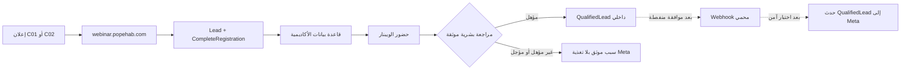

# Playbook الإطلاق الأول الآمن ومعيار QualifiedLead

## القرار الاستراتيجي

نبدأ الإطلاق الأول مثل تجربة معملية نظيفة: **رسالتان فقط أمام نفس الجمهور**. لا نضيف في نفس الأسبوع فلتر منطقة أحياء، جهاز، مؤهل، ميزانية بدء، أو Ad Set ثانية. هذه ليست «مخاطرة أقل»؛ بل متغيرات إضافية تجعلنا لا نعرف هل جاء التحسن من الكريتيف أم من الجمهور أم من التضييق.

> القاعدة: Meta تتعلم من الإشارة التي نرسلها، لا من النوايا التي نفترضها. لذلك أول دورة تقيس `Lead` بوضوح، ثم يُمنح لقب `QualifiedLead` فقط بعد تحقق بشري موثق من رحلة العميل.

## 1. الإطلاق الأول — ما يُطبَّق الآن داخل Ads Manager

| البند | الإعداد التنفيذي | بوابة النجاح |
|---|---|---|
| Campaign | `EPA \| Webinar \| Website Leads \| C01-vs-C02 \| W1 \| Draft` | تظل `In draft` حتى مراجعة النهاية. |
| Ad Set | `EPA \| Prospecting \| Cairo-Giza \| M25-44 \| Website Lead \| W1` | Ad Set واحدة فقط. |
| Conversion | Website → `academy pixel` (`1604627917208516`) → `Lead` | Test Events أثبتت `Lead` و`CompleteRegistration` على `webinar.popehab.com`. [1] |
| Bid | Maximize number of leads / Highest volume / بلا Cost per result goal | لا Cost Cap في الجولة الأولى. |
| Budget | Lifetime 4,200 جنيه مصري | لا يوجد إنفاق قبل Publish مستقل. |
| الفترة | 20 أغسطس، 10:00 إلى 26 أغسطس، 21:00 بتوقيت حساب الإعلان | تظل تاريخياً في Draft حتى تأكيد موعد النشر. |
| Dayparting | 10:00–14:00 و18:00–21:00 يومياً؛ **Use ad account time zone** | نوافذ ذروة مفترضة من البيانات، لا وعد أداء. [2] |
| Audience | القاهرة + الجيزة، رجال، 25–44، Original/Manual Audience | لا Pin، لا شرط جهاز، لا مؤهل، ولا فلتر لغة. |
| Detailed targeting | لا قيود اهتمام في الجولة الأولى | الكريتيف والصفحة يفرزان النية؛ لا نخلق جمهوراً ضيقاً بلا دليل. |
| Placements | Facebook Feed وFacebook Video Feeds فقط | نستبعد Instagram وMessenger وWhatsApp وAudience Network في الدورة الأولى. [2] |
| Ads | C01 الخريطة وC02 التوريد، مقاس 4:5 فقط | لا فيديو، لا Store، لا C03–C05. |
| URL | `https://webinar.popehab.com/` + UTM مستقل لكل كريتيف | نراجع الرابط من Preview قبل Publish. |

### التسلسل العملي المتبقي في الواجهة

1. تبديل Time zone إلى **Use ad account time zone**.
2. فتح Audience ثم الانتقال إلى Original/Manual Audience عند ظهور هذا الاختيار، وضبط القاهرة والجيزة، 25–44، رجال، مع ترك Language وDetailed targeting فارغين.
3. تحويل Placements إلى Manual واختيار Facebook Feed وFacebook Video Feeds فقط.
4. الانتقال إلى مستوى الإعلان، رفع C01 ثم C02 كإعلانين منفصلين، وإضافة الكوبي والرابط وUTM.
5. فتح Review؛ لا Publish قبل إزالة/فهم تحذير Near account spending limit ومراجعة كل قيم Draft.

## 2. ما نقيسه في الإطلاق الأول

لا يكون الحكم من `Cost per result` وحده. نقرأ لكل إعلان: `Lead` ثم `CompleteRegistration` ثم `CampaignWhatsAppHandoff`، ونقارن المسار داخل نفس Ad Set. بعد الويبنار نضيف سجل الحضور ثم التأهيل البشري؛ عندها فقط يصبح الحديث عن جودة حقيقية ممكناً. [1]

| مرحلة الرحلة | مصدر الحقيقة | قرار العمل |
|---|---|---|
| `Lead` | Pixel Academy + قاعدة بيانات الصفحة | إشارة التحسين في الجولة الأولى. |
| `CompleteRegistration` | Pixel Academy | تحقق أن التسجيل اكتمل؛ مؤشر جودة جانبي. |
| `CampaignWhatsAppHandoff` | Pixel Academy / رحلة الصفحة | تحقق من وصول التسجيل لمسار واتساب. |
| Webinar attendance | قائمة حضور Google Meet أو سجل تشغيل موثق | لا يُفترض من مشاهدة الإعلان أو ملء النموذج. |
| `QualifiedLead` | اعتماد بشري من فريق الأكاديمية بعد دليل واضح | لا ينشأ آلياً من الحي أو المؤهل أو الجهاز. |

## 3. تعريف QualifiedLead الصحيح

يُسجل Lead على أنه `QualifiedLead` فقط إذا اجتمعت الشروط الأربعة التالية:

| المعيار | الدليل المقبول | ما لا يكفي وحده |
|---|---|---|
| تواصل قابل للتحقق | واتساب مصري صالح + إيميل صحيح + موافقة واتساب | فتح النموذج أو `CTA_Click`. |
| تفاعل حقيقي مع الويبنار | حضور أول 30 دقيقة، أو سبب موثق لإعادة الجدولة | التسجيل فقط. |
| ملاءمة المسار | عضو فريق مخول يضع نتيجة مراجعة موثقة: المسار مناسب للدبلومة/غير مناسب/يحتاج متابعة | افتراض من العمر أو الحي أو الهاتف. |
| موافقة صريحة | استمرار موافقة واتساب وعدم وجود `unsubscribedAt` | أي رسالة أو حملة سابقة بلا موافقة حالية. |

لا نضع «ميزانية 15–20 ألف» أو الحضور في مقر الأكاديمية ضمن تعريف الجولة الأولى؛ لأنهما لم يُعتمدا كشرط عرض للدبلومة ولا يطابقان الويبنار الرقمي الحالي.

## 4. مسار البيانات المقترح

## 5. كيف نربط QualifiedLead قبل الفلاتر العميقة

### المرحلة الآمنة الآن — توثيق داخلي فقط

نضيف حالة منفصلة في قاعدة البيانات (`PENDING`, `QUALIFIED`, `NOT_QUALIFIED`, `RESCHEDULED`) مع `qualifiedAt`, `qualifiedBy`, و`qualificationReason`. يتغير السجل فقط من إجراء إداري محمي، بعد اختيار المراجع سبباً من قائمة موحدة. هذه المرحلة لا تلمس Meta ولا CAPI ولا n8n؛ هدفها أن نمنع أي تصنيف تخميني ونبني سجل تدقيق.

### المرحلة التالية — تغذية Meta بعد موافقة منفصلة

بعد وجود إشارة بشرية موثقة، يرسل الخادم طلباً واحداً إلى Webhook إنتاجي محمي من n8n بهوية Lead ومعرف `event_id` ثابت، مثل `qualified-lead:<leadId>:<version>`. تقوم المسودة بتحويله إلى حدث `QualifiedLead` فقط بعد تحقق Header secret ومنع التكرار وتسجيل Audit log. تدعم n8n Webhook الإنتاجي وHeader authentication، لكن URL الإنتاج لا يعمل إلا بعد نشر Workflow؛ لذلك يبقى هذا المسار Draft حتى موافقتك الصريحة. [3]

لا ننشئ CAPI جديداً ولا نغير Token أو Pixel أو نرسل حدثاً حقيقياً قبل تلك الموافقة. كما لا نستخدم `Purchase` أو Audience Upload في هذا المسار.

## 6. البدائل المتاحة قبل تشغيل التغذية الراجعة

| المسار | ما يحدث | الميزة | المقابل | القرار المقترح |
|---|---|---|---|---|
| **سجل تأهيل داخلي فقط** | المراجع يعتمد QualifiedLead في قاعدة البيانات وتظهر تقارير جودة يدوية | لا تغيير Meta ولا مخاطر خصوصية أو تشغيل | Meta تظل محسنة على `Lead` في الدورة الأولى | **يبدأ به الآن** |
| **تغذية راجعة محمية بعد الاعتماد** | الحدث الموثق فقط يصل إلى Meta عبر Webhook وAudit log | يبدأ التعلم من الإشارة الأعلى جودة | يحتاج Migration واختبارات وWorkflow إنتاجي وموافقة منفصلة | **يبنى Draft بعد تثبيت المعيار** |

## 7. بوابات لا نتجاوزها

- [ ] اعتماد إعدادات Audience وPlacements المذكورة في الجدول قبل تغيير الشاشة الحالية.
- [ ] اعتماد C01 وC02 المرئيين قبل رفعهما.
- [ ] مراجعة Near account spending limit داخل Billing قبل Publish.
- [ ] اعتماد تعريف QualifiedLead الأربعى ومن يملك حق وضع الحالة.
- [ ] اعتماد بناء مسار داخلي للتأهيل، ثم — لاحقاً وبموافقة منفصلة — اختبار Webhook وحدث Meta.

## المراجع

[1]: [توثيق اختبار الدومين وPixel](./domain_connection_run_log.md)

[2]: [قرار GOLD MATRIX المصحح والبيانات التاريخية](./gold_matrix_historical_review.md)

[3]: [n8n Webhook documentation](https://docs.n8n.io/integrations/builtin/core-nodes/n8n-nodes-base.webhook)
